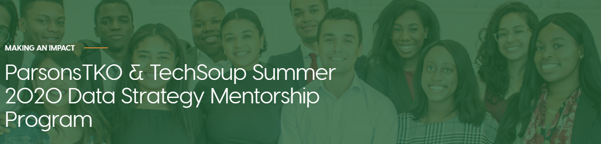
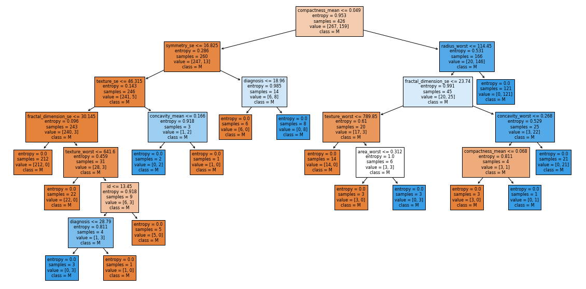

# Medium Posts' Reference Programming Notebooks

## TechSoup and ParsonsTKO Summer 2020 Data Strategy Mentorship Program

### Working with APIs

[An Introduction to Data Collection: REST APIs with Python & Pizzas](https://medium.com/@geocuriosity/an-introduction-to-data-collection-rest-apis-with-python-pizzas-7b682cef676c)

[Notebook](https://nbviewer.jupyter.org/github/HP-Nunes/Medium_codeRepo/blob/master/api_OpenAQ.ipynb)

### Pythonic GIS

[Spatial Intersects with Geopandas](https://medium.com/analytics-vidhya/spatial-intersects-with-geopandas-420c98915ca9)

[Notebook]()

## Machine Learning

### KNN

[Won't You Be My Neighbor?](https://medium.com/@geocuriosity/wont-you-be-my-neighbor-f69cebceaed4)

[Notebook](https://nbviewer.jupyter.org/github/HP-Nunes/Medium_codeRepo/blob/master/KNN_notebook.ipynb)

<b>Further Reading</b>

* [K-Nearest Neighbors Algorithm in Python and Scikit-Learn](https://stackabuse.com/k-nearest-neighbors-algorithm-in-python-and-scikit-learn/)
* [KNN visualization in just 13 lines of code](https://towardsdatascience.com/knn-visualization-in-just-13-lines-of-code-32820d72c6b6)
* [A Gentle Introduction to k-fold Cross-Validation](https://machinelearningmastery.com/k-fold-cross-validation/)
* [Class Imbalance Problem](http://www.chioka.in/class-imbalance-problem/#:~:text=What%20is%20the%20Class%20Imbalance,class%20of%20data%20(negative).)
* [Classification Report](https://www.scikit-yb.org/en/latest/api/classifier/classification_report.html)
* [Precision vs Recall](https://towardsdatascience.com/precision-vs-recall-386cf9f89488#:~:text=Precision%20and%20recall%20are%20two,correctly%20classified%20by%20your%20algorithm)
* [How do I interpret the given classification report?](https://datascience.stackexchange.com/questions/57192/how-do-i-interpret-the-given-classification-report)
* [How to interpret classification report of scikit-learn?](https://datascience.stackexchange.com/questions/64441/how-to-interpret-classification-report-of-scikit-learn)

### Decision Tree Classifier

[Link to Article here]

[Notebook](https://nbviewer.jupyter.org/github/HP-Nunes/Medium_codeRepo/blob/master/DecisionTreeClassifier_notebook.ipynb)

<b>Further Reading</b>

* [Coursera course: Pruning Decision Trees](https://www.coursera.org/lecture/ml-classification/optional-pruning-decision-trees-to-avoid-overfitting-qvf6v)
* [Decision Tree: Build, Prune, and Visualize using Python](https://towardsdatascience.com/decision-tree-build-prune-and-visualize-it-using-python-12ceee9af752)
* [Sklearn documentation: DecisionTreeClassifier](https://scikit-learn.org/stable/modules/generated/sklearn.tree.DecisionTreeClassifier.html)
* [Pruning Decision Trees](https://www.displayr.com/machine-learning-pruning-decision-trees/)
* [Study of Various Decision Tree Pruning Methods with their Empirical Comparison in WEKA](https://pdfs.semanticscholar.org/025b/8c109c38dc115024e97eb0ede5ea873fffdb.pdf)
